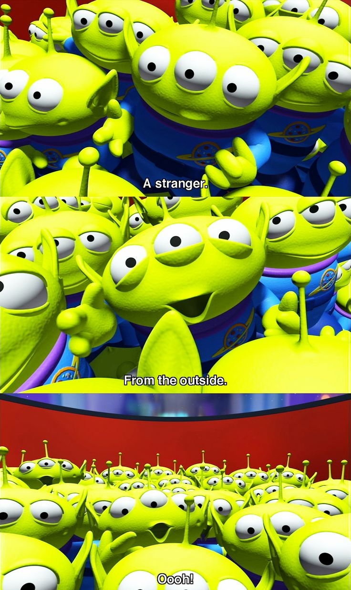

# JavaScript Homework - JavaScript and DOM Manipulation

## Our Story - do they come in peace?

WAKE UP SHEEPLE! The extra-terrestrial menace has come to Earth and we here at `ALIENS-R-REAL` have collected all of the eye-witness reports we could to prove it! All we need to do now is put this information online for the world to see and then the matter will finally be put to rest.

There is just one tiny problem though... our collection is too large to search through manually. Even our most dedicated followers are complaining that they are having trouble locating specific reports in this mess.

That's why we are hiring you. We need you to write code that will create a table dynamically based upon collected data. We also need to allow our users to filter the table data for specific values. There's a catch though... we only use pure JavaScript, HTML, and CSS, and D3.js on our web pages. They are the only coding languages which can be trusted.

You can handle this... right? The planet Earth needs to know what we have found!

### Level 1: Automatic Table and Date Search

A new website has been created so that you can look at data collected in January of 2010 on various sitings. 

A quick and easy table will guide you through all the information you want to know.  You are able to specify the date that
you are most interested in. 

Enjoy your journey, be on the look out though, you never know who is watching!

### Copyright

Trilogy Education Services © 2019. All Rights Reserved.
